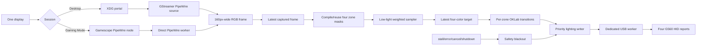
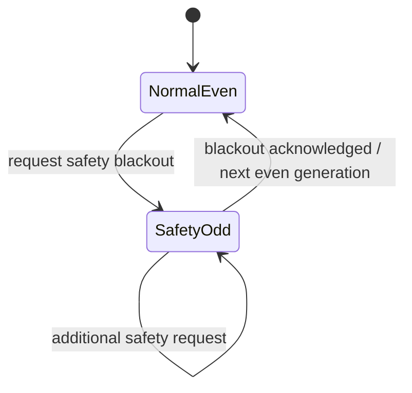

# Architecture

## System purpose

LogiLightShow turns one selected display into four ambient-light targets for Logitech G560 speakers. It minimizes perceptible lag by keeping only the newest work at every stage, while a separate priority path turns all zones black when continuing to show scene colors would be unsafe or misleading.

## End-to-end data flow



Both capture backends produce the same `RgbFrame` type. Everything after capture is backend-independent.

## Process-level composition

`src/main.rs` owns process lifecycle:

1. Parse a CLI command.
2. Construct the selected capture factory.
3. Construct a recovering G560 sink.
4. Open the speakers and send an initial safety blackout.
5. Start the engine, signal task, and five-second metrics loop.
6. On completion or signal, wait for engine teardown and print totals.

Desktop `run` uses `PortalFrameSourceFactory`; Gaming `run-gaming` uses `GamescopeFrameSourceFactory`. Both are wrapped in `RecoveringFrameSource`. The G560 factory is wrapped in `RecoveringLightSink`.

## Engine concurrency

`run_engine_with_sampler_and_metrics` in `src/engine.rs` coordinates three logical stages.

### Capture task

- Calls `FrameSource::next_frame` continuously.
- Timestamps each accepted frame with `Instant::now()`.
- Tags it with the current capture generation.
- Sends it through a latest-only channel.
- Counts a replaced unread frame as dropped.
- Always calls `FrameSource::shutdown` on teardown.

### Sampling coordinator

- Owns the 500 ms capture-stall timer.
- Rejects frames from invalid/blackout generations.
- Compiles and caches `ZoneMasks` by frame dimensions.
- Offloads CPU sampling through `spawn_blocking`.
- Rechecks generation after sampling so work captured before a blackout cannot relight the speakers.
- Sends the result through another latest-only channel.
- Requests safety blackout on stall, cancellation, source completion, or teardown.

### Lighting writer

- Owns the visible transition state and last confirmed displayed colors.
- Selects between safety commands, write deadlines, and new targets with biased priority in that order.
- Normal targets retarget an interruptible OKLab transition from the last hardware-confirmed value.
- Writes at 20 ms deadlines while a transition is active.
- Sends colors to `LightSink::write_update`, which can report rendered, unchanged, or expired.
- Clears normal state and sends black immediately for a safety command.

The USB sink itself owns a dedicated standard thread, so synchronous libusb calls and the calibrated inter-report delay never block Tokio worker threads.

## Newest-value design

The pipeline deliberately drops obsolete work:

- GStreamer appsink stores at most one buffer and drops older buffers.
- Desktop and Gaming capture have upstream one-buffer/newest-frame behavior.
- `latest_channel` holds only one unread `CapturedFrame` or `SampledUpdate`.
- The writer can replace a target that has not reached hardware.
- USB safety mode rejects queued normal writes as expired.

This is not data loss to be “fixed” with a queue. It is the latency policy: for ambient lighting, showing the current scene is more important than rendering every past scene.

## State and safety generations

Capture generations prevent a race where old work relights after black:



- Even generation: normal frame and target work may proceed.
- Safety request atomically moves to an odd generation.
- Frames and sampled targets carry the generation they began under.
- The writer acknowledges black before normal work resumes on the next even generation.
- Work tagged with a stale or odd generation is dropped.

This generation check exists both before and after sampling because sampling runs in a blocking task and can overlap a safety event.

## Recovery layers

### Capture recovery

`RecoveringFrameSource`:

- Opens a source lazily.
- Retries factory-approved open/stream errors with 250 ms exponential backoff capped at 5 s.
- Shuts down a failed source before reopening.
- Tracks open failures, stream failures, successful reopens, and shutdown failures.
- Does not retry explicit portal cancellation, invalid stream count/caps/layout, EOS, or an initial non-retryable pipeline failure.

The Desktop factory only treats runtime pipeline failures as retryable after one source has opened successfully. This prevents a permanently invalid initial setup from looping silently. The Gaming factory retries stream errors unless they represent explicit cancellation.

### USB recovery

`RecoveringLightSink`:

- Lazily opens the device.
- Retries missing/busy speakers with the same bounded backoff.
- Resets failure count after a successful write.
- After three consecutive write failures, attempts blackout, releases the sink, and reopens.
- Refuses to render a captured target older than the 500 ms freshness bound; it writes black instead.

## Metrics

Every five seconds the CLI reports:

- capture FPS for the interval;
- rendered updates per second;
- cumulative dropped/replaced work;
- cumulative capture stalls;
- cumulative p50/p95/p99 capture-to-successful-write latency;
- USB write failures;
- capture stream/open/reopen/shutdown counters.

Metrics intentionally omit pixels and colors. `rendered_updates_per_second=0.0` is normal for a static scene because unchanged colors are coalesced at the USB layer.

## Source dependency direction

```text
main.rs
  ├─ capture::{portal, gstreamer, gamescope}
  ├─ engine
  │   ├─ frame / masks
  │   ├─ sampler
  │   ├─ transition
  │   └─ latest
  └─ usb::{device, protocol}
```

Core abstractions (`FrameSource`, `FrameSourceFactory`, `LightSink`) live in the engine module so capture and USB implementations can be tested behind fakes.

## Where to change behavior

| Desired change | Start here | Also inspect |
|---|---|---|
| Portal selection or permission | `src/capture/portal.rs` | config handling in `src/main.rs` |
| Desktop pixel transport/caps | `src/capture/gstreamer.rs` | GStreamer tests and Bazzite handoff |
| Gaming capture | `src/capture/gamescope.rs` | service unit and PipeWire dependencies |
| Zone shapes | `src/frame.rs` | quadrant test page and hardware mapping |
| Dark/color selection | `src/sampler.rs` | color pipeline tests and transition behavior |
| Fade behavior | `src/transition.rs`, writer state in `src/engine.rs` | safety-preemption tests |
| Stall/retry policy | `src/engine.rs` | operations/troubleshooting docs |
| USB protocol/cadence | `src/usb/` | hardware results; real audio test required |
| CLI/service | `src/main.rs`, `systemd/`, `scripts/` | README and operations docs |

Architecture-changing work should update or add an ADR under `docs/decisions/`.
