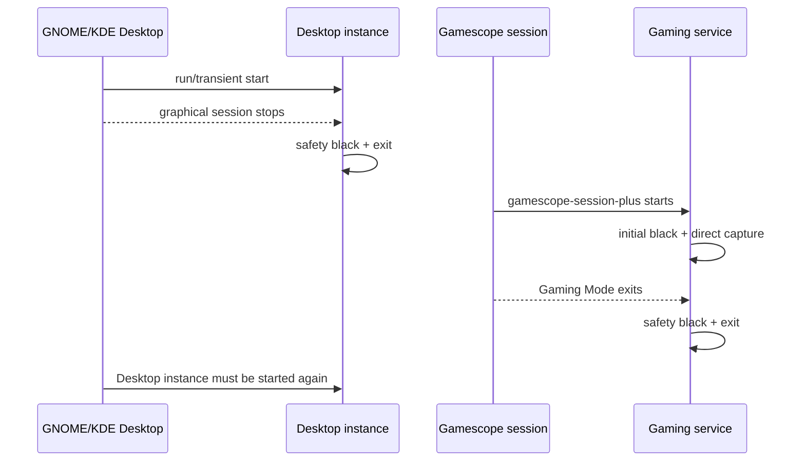

# Operations runbook

## Preflight

Before starting a live instance:

```bash
pgrep -af logig560 || true
lsusb -d 046d:0a78
systemctl --user is-active logig560-desktop-live.service || true
systemctl --user is-active logig560-gaming.service || true
```

Only one process should own the G560 lighting interface.

## Desktop Mode

### Foreground

```bash
./target/release/logig560 run
```

Use Ctrl-C for clean stop and final blackout.

### Accepted transient user unit

The prototype does not ship a persistent Desktop service. For a background test tied to the current graphical session:

```bash
systemd-run --user \
  --unit=logig560-desktop-live \
  --collect \
  --property=PartOf=graphical-session.target \
  --property=After=graphical-session.target \
  --working-directory=/home/jaret/Documents/G560 Linux Utility \
  /home/jaret/Documents/G560 Linux Utility/target/release/logig560 run
```

Adjust both paths if the repository moves.

Status and logs:

```bash
systemctl --user status logig560-desktop-live.service --no-pager
journalctl --user -u logig560-desktop-live.service -f
```

Clean stop:

```bash
systemctl --user stop logig560-desktop-live.service
```

Because the unit uses `--collect`, it may disappear after stopping. Wait for that before reusing the same transient name.

## Gaming Mode

Build release first, then install/enable:

```bash
./scripts/install-gaming-service.sh
```

The script verifies the checked-in unit and enables it. It does not start the service in Desktop Mode.

Expected Desktop state:

```bash
systemctl --user is-enabled logig560-gaming.service
# enabled
systemctl --user is-active logig560-gaming.service
# inactive
```

In Gaming Mode it starts with `gamescope-session-plus@steam.service` and stops when that session stops.

Logs after returning to Desktop:

```bash
journalctl --user -u logig560-gaming.service -b --no-pager
```

Disable and stop:

```bash
./scripts/uninstall-gaming-service.sh
```

## Session switching

The intended lifecycle is:



There is no persistent Desktop autostart yet. Returning from Gaming Mode does not automatically recreate the transient Desktop unit.

## Deploying a rebuilt binary

Linux can keep the old executable inode running after `cargo build --release` replaces the path. A successful build alone does not update a live process.

1. Build and validate.
2. Stop the exact active unit cleanly.
3. Confirm no process remains.
4. Start the unit again.
5. Verify its new invocation logs.

```bash
systemctl --user stop logig560-desktop-live.service
pgrep -af logig560 || true
```

Do not kill the process merely to load a new binary; clean stop is part of safety behavior.

## Reading runtime metrics

Example fields:

```text
captured_fps=18.8
rendered_updates_per_second=7.4
dropped=8
stalls=0
latency_ms[p50=72.45 p95=86.27 p99=87.17]
USB_errors=0
capture_errors[stream=0 open=0 reopens=0 shutdown=0]
```

Interpretation:

- `captured_fps`: interval rate reaching the engine. About 18–20 during motion is expected. Around 5 can be normal when the Desktop static-frame hold is supplying one frame every 200 ms.
- `rendered_updates_per_second`: successful changed hardware states. Zero is normal for static content.
- `dropped`: cumulative newest-value replacements and stale/invalidated work. Some drops are expected under motion or blocked writes.
- `stalls`: cumulative 500 ms engine safety events. Correlate increments with suspend, lock, or visual off/on.
- latency percentiles: cumulative capture-to-write time for rendered updates, not a rolling five-second distribution.
- USB/capture counters: cumulative recovery evidence.

Do not diagnose from FPS alone. Use changes in `stalls`, error counters, system suspend/lock logs, and the visual symptom together.

## Correlating an event

Record the current invocation ID:

```bash
systemctl --user show logig560-desktop-live.service \
  -p InvocationID -p MainPID -p ActiveState -p SubState
```

Then query only that invocation:

```bash
journalctl --user _SYSTEMD_INVOCATION_ID=INVOCATION_ID --no-pager
```

For system suspend/graphics correlation:

```bash
journalctl --since 'YYYY-MM-DD HH:MM:SS' \
  --until 'YYYY-MM-DD HH:MM:SS' -o short-precise --no-pager
```

An accepted-run stall at 09:59:16 was traced to the entire user slice being frozen during a system suspend attempt, not to dark color sampling. This is why timestamp correlation matters.

## Expected shutdown output

A clean foreground/service stop prints totals and attempts final black. Capture portal shutdown can occasionally report a portal peer disconnect while the entire graphical session is already terminating. Preserve the primary and cleanup error in diagnostics; do not omit blackout just to make teardown logs quieter.

## Routine health check

```bash
systemctl --user is-active logig560-desktop-live.service || true
systemctl --user is-enabled logig560-gaming.service
systemctl --user is-active logig560-gaming.service || true
journalctl --user -u logig560-desktop-live.service -n 10 --no-pager
lsusb -d 046d:0a78
```

On Desktop, the desired prototype state is Desktop active and Gaming enabled/inactive.
