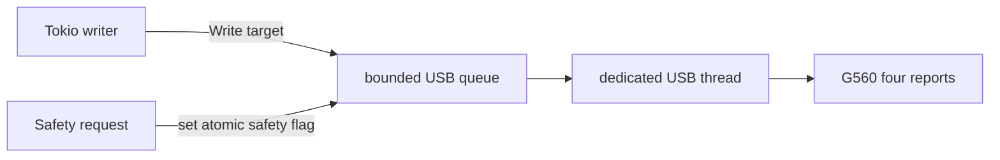

# G560 USB and safety model

## Device facts

| Item | Value |
|---|---|
| USB vendor/product | `046d:0a78` |
| Claimed interface | `2` |
| Expected interface class | HID (`0x03`) |
| Report length | 20 bytes |
| Control request | `bmRequestType=0x21`, `bRequest=0x09` |
| Control value/index | `wValue=0x0211`, `wIndex=0x0002` |
| Transfer timeout | 100 ms |
| Production report spacing | 6 ms |

The driver validates every alternate descriptor for interface 2 as HID before detaching a kernel driver. If claim fails after detach, it attempts reattachment and preserves both errors if reattachment also fails. `Drop` releases the interface and reattaches the original kernel driver when needed.

## Solid-color report

The first nine bytes are:

```text
11 ff 04 3a INDEX 01 RR GG BB
```

The remaining eleven bytes are zero.

Logical-to-protocol mapping, physically verified on the G560:

| Logical zone | Protocol index |
|---|---:|
| Left front | `0x00` |
| Right front | `0x01` |
| Left rear | `0x02` |
| Right rear | `0x03` |

The application's logical array/write order remains left rear, left front, right front, right rear. Do not confuse write order with protocol index order.

## Report pacing

Every adjacent USB report is separated by 6 ms, including:

- reports within one four-zone write;
- the last report of one write and first report of the next;
- normal write followed by blackout;
- separate public method calls.

The delay belongs to the device object and is based on whether any report has previously been sent. It is not a per-call sleep.

Hardware calibration passed staged delays down to 4 ms. Production selected 6 ms: the fastest passing stage plus a 2 ms margin. Changing this constant requires repeating calibration with audio playing and updating the hardware evidence.

## Coalescing

`G560::write` skips an entire four-report update when `ZoneColors` exactly matches the cached previous value. A failed write is never cached as successful. `blackout` always emits all four black reports even if the cache already says black; safety cleanup must not rely on cache state.

## Async adapter

libusb operations and inter-report sleeps are synchronous. `AsyncG560` moves them to a dedicated standard thread with a bounded FIFO command queue of 32 entries.



When blackout is requested:

1. An atomic safety flag is set before the blackout command is enqueued.
2. The USB worker reports queued normal writes as expired rather than sending them.
3. The blackout command sends all four black reports.
4. The worker clears safety only after blackout processing.

This preserves FIFO ownership and report spacing while allowing safety to invalidate stale queued normal work.

## Startup and shutdown

Every live run:

1. Opens and claims the G560.
2. Sends an initial all-zone blackout.
3. Starts accepting captured targets only after that completes.

Every normal engine teardown requests a safety blackout before dropping the sink. Ctrl-C and SIGTERM enter this path. A crash or `SIGKILL` cannot guarantee cleanup, which is why every future start begins black.

## Safety event matrix

| Event | Normal fade? | Output action |
|---|---:|---|
| Sampled zone becomes black | Yes, 200 ms for that zone | normal target |
| Ordinary color change | Yes, 90 ms | normal target |
| No capture frame for 500 ms | No | immediate all-zone black |
| Capture stream error | No | immediate black, then recovery if retryable |
| Portal/Gamescope shutdown | No | immediate black |
| Ctrl-C / SIGTERM | No | immediate black, close resources |
| Three USB write failures | No | blackout attempt, release, reopen |
| Captured target older than 500 ms during USB recovery | No | black instead of stale scene |

## Recovery and error accounting

The recovering sink tracks:

- device open failures;
- USB write failures;
- reopen count;
- blackout failures.

Backoff is 250 ms, 500 ms, 1 s, 2 s, 4 s, then 5 s maximum. Cancellation preempts backoff and missing-device waits.

After three consecutive write failures, the current device is blacked out if possible and dropped. The next write attempts a fresh open. Successful writes reset the backoff and consecutive failure count.

## Permission boundary

Runtime remains unprivileged. `contrib/70-logilightshow-g560.rules` grants the active local user access when the device is added:

```udev
ACTION=="add", SUBSYSTEM=="usb", ATTR{idVendor}=="046d", ATTR{idProduct}=="0a78", TAG+="uaccess"
```

`scripts/install-udev-rule.sh` uses `pkexec` only to copy that specific rule and reload/trigger udev. Never solve access problems by running LogiLightShow with `sudo`.

## Hardware diagnostics

Use static colors to isolate USB from capture:

```bash
./target/release/logilightshow set-zones \
  --left-rear FF0000 \
  --left-front 00FF00 \
  --right-front 0000FF \
  --right-rear FFFFFF
```

Pulse one raw index for mapping:

```bash
./target/release/logilightshow verify-zone 0
```

Run the five-minute rotating soak:

```bash
./target/release/logilightshow verify-soak
```

Re-run pacing calibration only when intentionally validating hardware timing:

```bash
./target/release/logilightshow calibrate-pacing --delay-ms 6 --seconds 15
```

Stop every live service first. Keep audio playing. These commands physically change the lights, and calibration produces sustained USB traffic.
